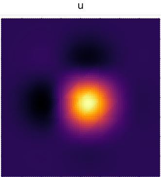

# Example: approximating derivatives using DG

`MeshData` can be used to compute DG derivatives. Suppose ``f`` is a differentiable function and the domain ``\Omega`` can be decomposed into non-overlapping elements ``D^k``. The approximation of ``\frac{\partial f}{\partial x}`` can be approximated using the following formulation: find piecewise polynomial ``u`` such that for all piecewise polynomials ``v``
```math
\int_{\Omega} u v = \sum_k \left( \int_{D^k} \frac{\partial u}{\partial x}v + \int_{\partial D^k} \frac{1}{2} \left[u\right]n_x v \right)
```
Here, ``\left[u\right] = u^+ - u`` denotes the jump across an element interface, and ``n_x`` is the ``x``-component of the outward unit normal on ``D^k``.

Discretizing the left-hand side of this formulation yields a mass matrix. Inverting this mass matrix to the right hand side yields the DG derivative. We show how to compute it for a uniform triangular mesh using `MeshData` and `StartUpDG.jl`.

We first construct the triangular mesh and initialize `md::MeshData`.
```julia
using StartUpDG
using Plots

N = 3
K1D = 8
rd = RefElemData(Tri(),N)
VX,VY,EToV = uniform_mesh(Tri(),K1D)
md = MeshData(VX,VY,EToV,rd)
```
We can approximate a function ``f(x,y)`` using interpolation
```julia
f(x,y) = exp(-5*(x^2+y^2))*sin(1+pi*x)*sin(2+pi*y)
@unpack x,y = md
u = @. f(x,y)
```
or using quadrature-based projection
```julia
@unpack Pq = rd
@unpack x,y,xq,yq = md
u = Pq*f.(xq,yq)
```
We can use `scatter` in Plots.jl to quickly visualize the approximation. This is not intended to create a high quality image (see other libraries, e.g., `Makie.jl`,`VTK.jl`, or `Triplot.jl` for publication-quality images).
```julia
@unpack Vp = rd
xp,yp,up = Vp*x,Vp*y,Vp*u # interp to plotting points
scatter(xp,yp,uxp,zcolor=uxp,msw=0,leg=false,ratio=1,cam=(0,90))
```
Both interpolation and projection create a matrix `u` of size ``N_p \times K`` which contains coefficients (nodal values) of the DG polynomial approximation to ``f(x,y)``. We can approximate the derivative of ``f(x,y)`` using the DG derivative formulation
```julia
function dg_deriv_x(u,md::MeshData,rd::RefElemData)
  @unpack Vf,Dr,Ds,LIFT = rd
  @unpack rxJ,sxJ,J,nxJ,mapP = md
  uf = Vf*u
  ujump = uf[mapP]-uf

  # derivatives using chain rule + lifted flux terms
  ux = rxJ.*(Dr*u) + sxJ.*(Ds*u)  
  dudxJ = ux + LIFT*(.5*ujump.*nxJ)

  return dudxJ./J
end
```
We can visualize the result as follows:
```julia
dudx = dg_deriv_x(u,md,rd)
uxp = Vp*dudx
scatter(xp,yp,uxp,zcolor=uxp,msw=0,leg=false,ratio=1,cam=(0,90))
```
Plots of the polynomial approximation ``u(x,y)`` and the DG approximation of ``\frac{\partial u}{\partial x}`` are given below



 ⠀
